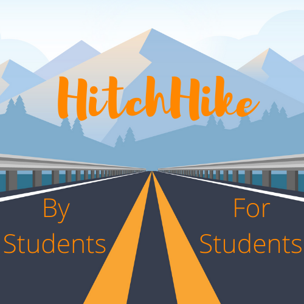
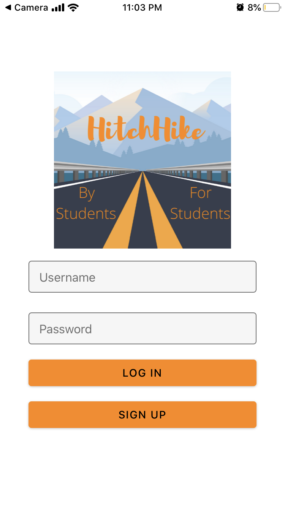
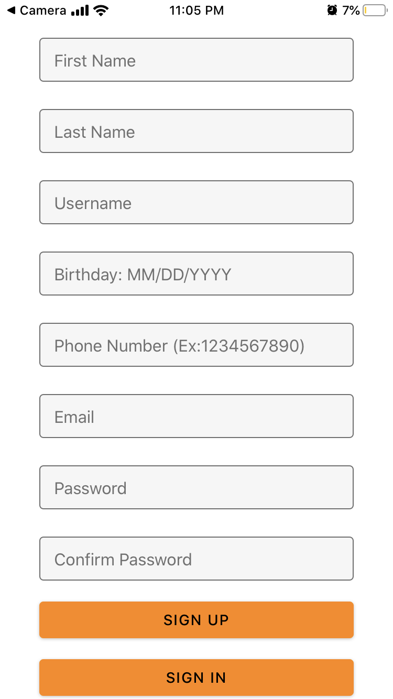
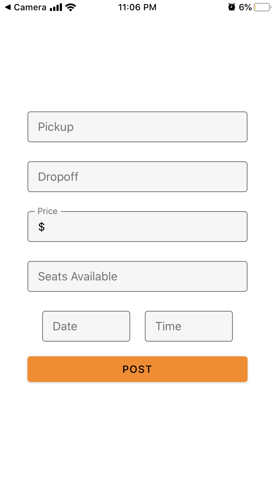
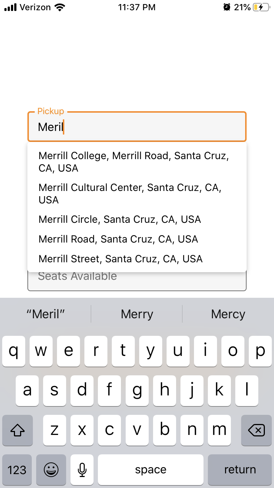
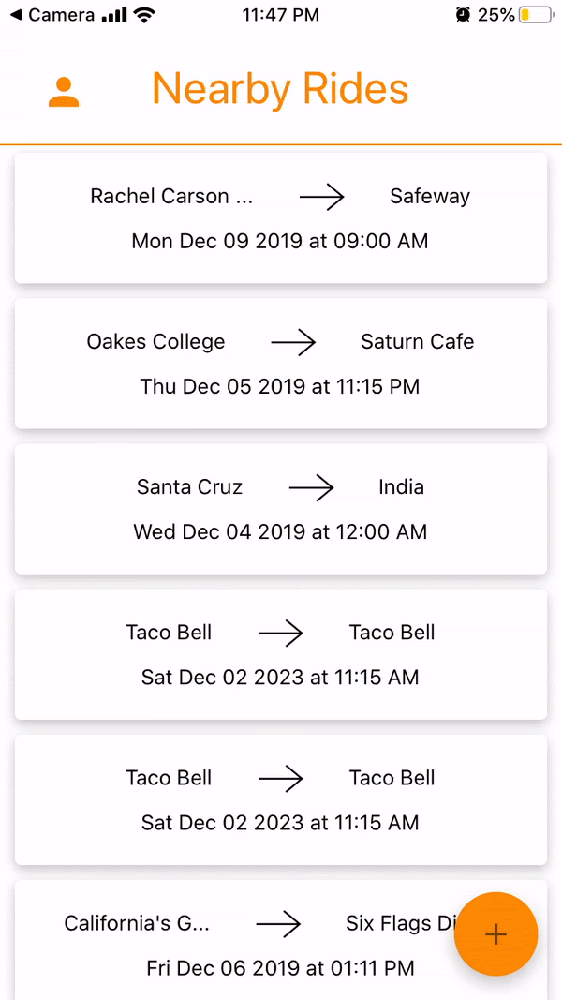

# HitchHike

<p align="center">
   
   <h3 align="center">Ridesharing for UCSC students!</h3>
</p>

HitchHike is a carpooling and ridesharing app intended for use by UCSC students. It allows users to search and view available rides near them as well as post new rides.

## Overview

The HitchHike [frontend](frontend/) consists of a mobile app built in React Native and Expo. The [backend](backend/) consists of a Node.js application using Express.js and a custom in-memory database written in javascript. The backend _was_ hosted on AWS EC2.

## Getting Started

### Dependencies

* `npm`
* `expo-cli`
* [Expo](https://expo.dev) mobile app

### Before Using

* The backend Node application needs to be publicly hosted.
* Some public APIs such as Google Maps and SendGrid need to be renewed.
* The app features some hardcoded endpoints that would need to be updated for functionality to be restored.
* Additionally, many dependencies are out of date and may have vulnerabilities.

### Building

To build the app run the commands:
```
$ cd hitchhike/frontend
$ npm install
$ npm start
```
Then scan the QR code to open HitchHike in the Expo app.

## Design

Since HitchHike will likely never be run again some screenshots are available in [assets](assets/).

<p align="center">
   
   
      
</p>

<p align="center">
   
    
    
</p>

## Acknowledgments

This app was created as part of coursework for [CSE 115A: Software Engineering](https://catalog.ucsc.edu/en/Current/General-Catalog/Courses/CSE-Computer-Science-and-Engineering/Upper-Division/CSE-115A) by a team of students.
